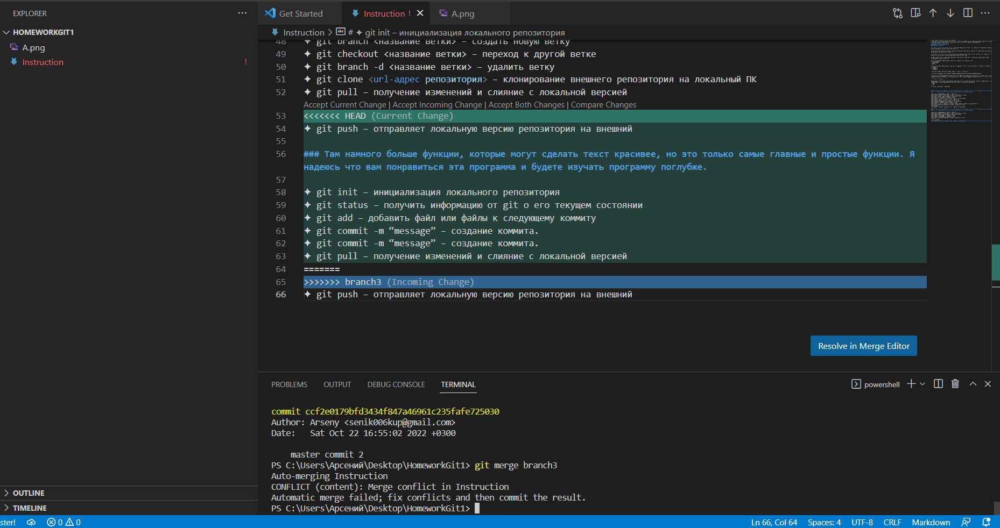

# Инструкция по работе с текстом git Markdown
✦ # Заголовок – выделение заголовков. Количество символов “#” задаёт уровень заголовка (поддерживается 6 уровней). Пример заголовка "#" можно увидеть немного выше этой строки. А вот и пару уровней заголовок:
## Example sentence number one!!!
### Example sentence number two!!!
#### Why am i so small?

✦ **Полужирное начертание** или __Bold__. Чтобы начертание было **полужирным**, нужно просто использовать без пробелов между определёнными словами символы "**" или "__".

✦ *Курсивное начертание* или _Italic_. Чтобы начертание было *курсивным*, нужно просто использовать без пробелов между определёнными словами символы "*" или "_".

✦ ***Полужирное курсивное начертание***. Чтобы начертание было *курсивным* ***И*** **полужирным**, нужно просто использовать без пробелов между определёнными словами символы "***".

✦ ~~Зачёркнутый текст~~. Чтобы начертание было ~~зачёркнуто~~, нужно просто использовать без пробелов между определёнными словами символы "~~".

✦ * Строка – ненумерованные списки, символ “*” в начале строки. Например так:
* first example
* second one
* third

✦ 1, 2, 3 … – нумерованные списки. Можно просто напечатать число вы хотите и поставить точку так "1.". Например:
1. Element 1
2. Element 2
3. Element 3

> блок цитирования. Блоки цитирования создаются с помощью символа ">":

> This is a blockquote. It is usually rendered indented and with a different background color.

✦ Комментарии. Документация поддерживает комментарии HTML, если необходимо закомментировать разделы статьи: В некоторых экранах комментарии невидимы, но можно увидеть их во всех остальных файлах. они выглядят так <!--- Here's my comment --->.
<!--- Here's my comment --->

✦Изображения. Чтобы выведить изображение, нужно импортировать картину в программу, тогда можно использовать "![text] (image.name)". Для изображений по умолчанию поддерживаются следующие типы файлов:
* .jpg
* .png

Вот пример изображения: 

✦ git init – инициализация локального репозитория

✦ git status – получить информацию от git о его текущем состоянии

✦ git add – добавить файл или файлы к следующему коммиту

✦ git commit -m “message” – создание коммита.

✦ git log – вывод на экран истории всех коммитов с их хеш-кодами

✦ git branch – посмотреть список веток в репозитории

✦ git branch <название ветки> – создать новую ветку

✦ git checkout <название ветки> – переход к другой ветке

✦ git branch -d <название ветки> – удалить ветку

✦ git clone <url-адрес репозитория> – клонирование внешнего репозитория на локальный ПК

✦ git pull – получение изменений и слияние с локальной версией

✦ git push – отправляет локальную версию репозитория на внешний

### Инструкция по работе с Github
1. создать аккаунт на Github.com
2. создать локальный репозиторий
3. "подружить" ваш локальный и удалённый репозиторий
4. отправить (push) ваш локальный репозиторий в удалённый (на Github), при этом вам, возможно, нужно будет авторизоваться на удалённом репозитории
5. провести изменения "с другого компьютера"
6. выкачать (pull) актуальное состояние из удалённого репозитория

### Как сделать pull request
1. сделать **fork** репозиторий
2. сделать *clone* **СВОЕЙ** версии репозитория
3. создать новую ветку и в **НЕЁ** вносить свои изменения
4. фиксировать свои изменения (*сделать commit*)
5. отправить свою версию в *свой Github*
6. на сайте Github нажать кнопку **pull request**

### Там намного больше функции, которые могут сделать текст красивее, но это только самые главные и простые функции. Я надеюсь что вам понравиться эта программа и будете изучать программу поглубже.

